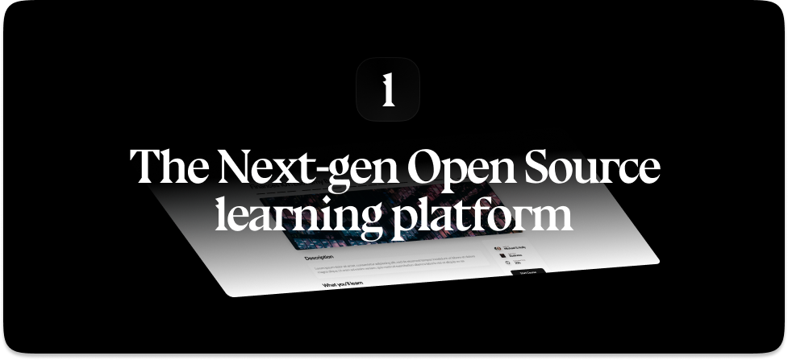

  

LearnHouse is an open source platform that makes it easy for anyone to provide world-class educational content and it offers a variety of content types : Dynamic Pages, Videos, Documents & more..

## Progress

🚧 LearnHouse is still on early development (alpha) and should not be used (yet) on production, as we reach stability we will release a stable version and add more features.

## Features

- 📄✨Dynamic notion-like pages
- 👨‍🎓 Easy to use
- 👥 Multi-Organization
- 📹 Supports Uploadable Videos and external videos like YouTube
- 📄 Supports documents like PDF
- 🍱 Course Collections
- 🙋 Quizzes
- 👟 Course progress
- ⚡ (Incoming) Live Collaboration
- More to come

## Community

Please visit our [Discord](https://discord.gg/CMyZjjYZ6x) community 👋

## Contributing

Thank you for you interest 💖, here is how you can help :

- [Getting Started](/CONTRIBUTING.md)
- Submit a bug report
- [Check good first issues & Help Wanted](https://github.com/learnhouse/learnhouse/issues?q=is%3Aopen+is%3Aissue+label%3A%22good+first+issue%22+label%3A%22help+wanted%22)
- Spread the word and share the project with your friends

## Documentation

- Features
  - [Courses](https://docs.learnhouse.app/features/courses)
  - [Activities](https://docs.learnhouse.app/features/activities)
    - [Dynamic Pages](https://docs.learnhouse.app/features/activities/dynamic-pages)
    - [Video Activities](https://docs.learnhouse.app/features/activities/video)
    - [Document Activities](https://docs.learnhouse.app/features/activities/documents)
  - [Collections](https://docs.learnhouse.app/features/collections)
  - [Trail](https://docs.learnhouse.app/features/trail)
- Self Hosting
  - [Overview](https://docs.learnhouse.app/technical-docs/self-hosting/overview)
  - [Organization Hosting Modes](https://docs.learnhouse.app/technical-docs/self-hosting/organization-hosting-modes)
  - [Docker & Kubernetes](https://docs.learnhouse.app/technical-docs/self-hosting/docker-and-kube)
  - [Using Vercel](https://docs.learnhouse.app/technical-docs/self-hosting/vercel)
  - Content Storage
    - [Using the Filesystem](https://docs.learnhouse.app/technical-docs/self-hosting/content-storage/filesystem)
    - [Using AWS S3 or CloudFlare R2](https://docs.learnhouse.app/technical-docs/self-hosting/content-storage/s3)
- Technical Docs
  - [Infrastructure Overview](https://docs.learnhouse.app/technical-docs/infra-overview)
  - Database overview
  - API Overview

## Tech

LearnHouse uses a number of open source projects to work properly:

- **Next.js** (13 with the App Directory) - The React Framework
- **TailwindCSS** - Styling
- **Radix UI** - Accessible UI Components
- **Tiptap** - An editor framework and headless wrapper around ProseMirror
- **FastAPI** - A high performance, async API framework for Python
- **YJS** - Shared data types for building collaborative software
- **MongoDB** - NoSQL Database
- **React** - duh

## A word

Learnhouse is made with 💜, from the UI to the features it is carefully designed to make students and teachers lives easier and make education software more enjoyable.

Thank you and have fun using/developing/testing LearnHouse !
