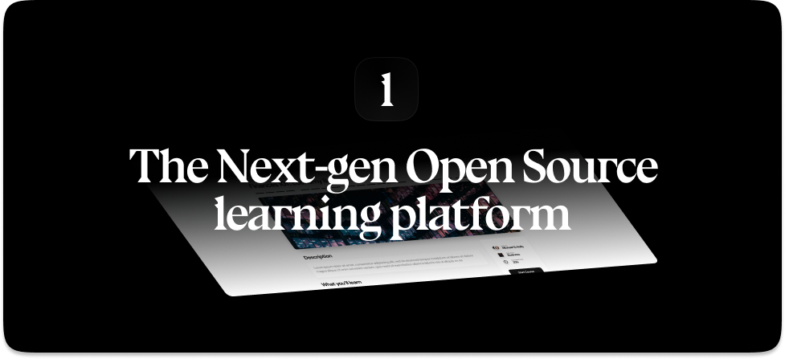

<p align="center">
  <a href="https://learnhouse.app">
    
  </a>
</p>

LearnHouse is an open source platform that makes it easy for anyone to provide world-class educational content and it offers a variety of content types : Dynamic Pages, Videos, Documents & more..

## Progress

🚧 LearnHouse is still on development (beta), as we reach stability we will release a stable version and add more features.

## Roadmap

We prioritize issues depending on the most requested features from our users, please help us prioritize issues by commenting on them and sharing your thoughts 

[🚢 LearnHouse General Roadmap](https://www.learnhouse.app/roadmap)

## Overview


- 📄✨Dynamic notion-like Blocks-based Courses & editor
- 🏎️ Easy to use
- 👥 Multi-Organization
- 📹 Supports Uploadable Videos and external videos like YouTube
- 📄 Supports documents like PDF
- 👨‍🎓 Users & Groups Management
- 🙋 Quizzes
- 🍱 Course Collections
- 👟 Course Progress
- 🛜 Course Updates
- ✨ LearnHouse AI : The Teachers and Students copilot
- More to come

## Community

Please visit our [Discord](https://discord.gg/CMyZjjYZ6x) community 👋

## Contributing

Thank you for you interest 💖, here is how you can help :

- [Getting Started](/CONTRIBUTING.md)
- [Developers Quick start](https://docs.learnhouse.app/setup-dev-environment)
- [Submit a bug report](https://github.com/learnhouse/learnhouse/issues/new?assignees=&labels=bug%2Ctriage&projects=&template=bug.yml&title=%5BBug%5D%3A+)
- [Check good first issues & Help Wanted](https://github.com/learnhouse/learnhouse/issues?q=is%3Aopen+is%3Aissue+label%3A%22good+first+issue%22+label%3A%22help+wanted%22)
- Spread the word and share the project with your friends

## Documentation

- [Overview](https://docs.learnhouse.app)
- [Developers](https://docs.learnhouse.app/setup-dev-environment)

## Get started 

### Get a local ready copy of LearnHouse

TLDR: Run `docker-compose up -d` and inspect the logs, should be ready to go in less than 2 mins

- [Self Hosting](https://docs.learnhouse.app/self-hosting/hosting-guide)

### Set-up a Development Environment 


For a detailed step-by-step guide on configuring the backend and frontend, please refer to the [Development Guide](/dev/DEVELOPMENT.md).

## 🔄 Updating from LearnHouse Upstream

**Quick Update Command:**

```bash
# From the repository root
./scripts/update-backend.sh
```

**Manual Update (if script not available):**

```bash
# Pull latest changes from LearnHouse main branch
git subtree pull --prefix=apps/api \
  https://github.com/learnhouse/learnhouse.git main \
  --squash
```

**After updating:**

1. Review changes: `git log --oneline -10`
2. Test locally: `cd apps/api && uv run uvicorn app:app --reload`
3. Check your customizations in `apps/api/src/custom/` are intact
4. Commit and push: `git add . && git commit -m "Update LearnHouse backend" && git push`

**Important Notes:**
- Your custom code in `apps/api/src/custom/` is **safe** and won't be modified
- Frontend is unaffected (it only calls APIs)
- Run the command from the **repo root**, not from `apps/api/`
- The `--squash` flag combines all upstream commits into one clean commit

For detailed documentation, see [Updating Backend Guide](learnhouse-industry-template/docs/updating-backend.md)

## Tech

LearnHouse uses a number of open source projects to work properly:

- **Next.js** (14 with the App Directory) - The React Framework
- **TailwindCSS** - Styling
- **Radix UI** - Accessible UI Components
- **Tiptap** - An editor framework and headless wrapper around ProseMirror
- **FastAPI** - A high performance, async API framework for Python
- **PostgreSQL** - SQL Database
- **Redis** - In-Memory Database
- **React** - duh

## LearnHouse University

<a href="https://university.learnhouse.io">

</a>

Learn about LearnHouse and how to use it, using LearnHouse


## A word

Learnhouse is made with 💜, from the UI to the features it is carefully designed to make students and teachers lives easier and make education software more enjoyable.

Thank you and have fun using/developing/testing LearnHouse !
