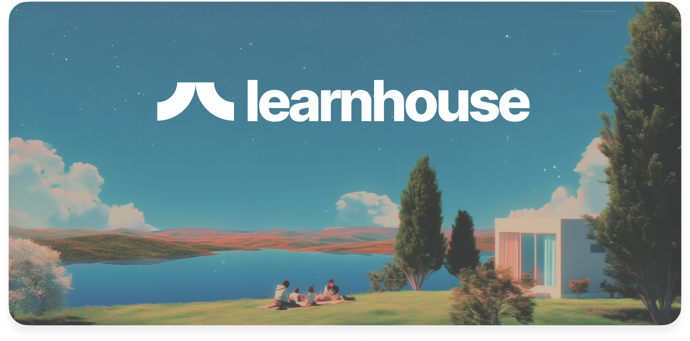

<p align="center">
  <a href="https://docs.learnhouse.app">
    
  </a>
</p>

<p align="center">
  <strong>LearnHouse Documentation</strong>
</p>

<p align="center">
  Official documentation for <a href="https://learnhouse.app">LearnHouse</a>, the open-source learning management system.
</p>

<p align="center">
  <a href="https://docs.learnhouse.app">docs.learnhouse.app</a>
</p>

---

## Local Development

**Prerequisites:** [Bun](https://bun.sh) installed.

```bash
# Install dependencies
bun install

# Start the dev server
bun dev
```

The site will be available at `http://localhost:3000`.

## Project Structure

```
content/          # MDX documentation pages
  getting-started/
  platform/
  self-hosting/
  developers/
  enterprise/
app/              # Next.js App Router
components/       # React components
public/           # Static assets
scripts/          # Build scripts
```

## Built With

- [Next.js](https://nextjs.org)
- [Nextra](https://nextra.site)
- [Tailwind CSS](https://tailwindcss.com)

## License

MIT - see [LICENSE](LICENSE) for details.
